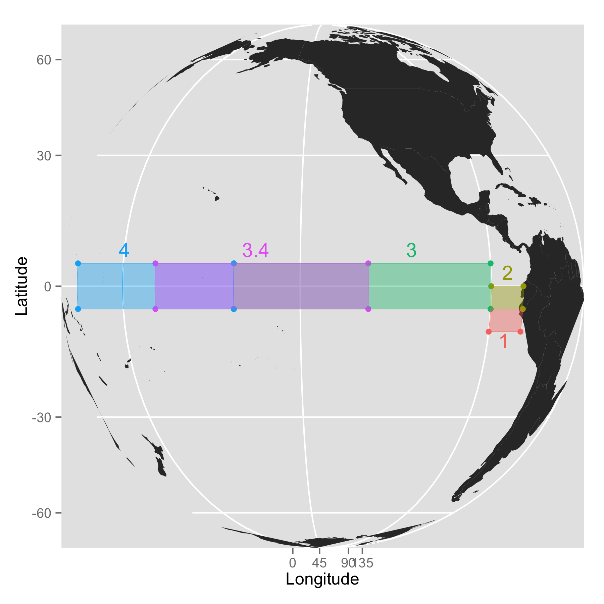
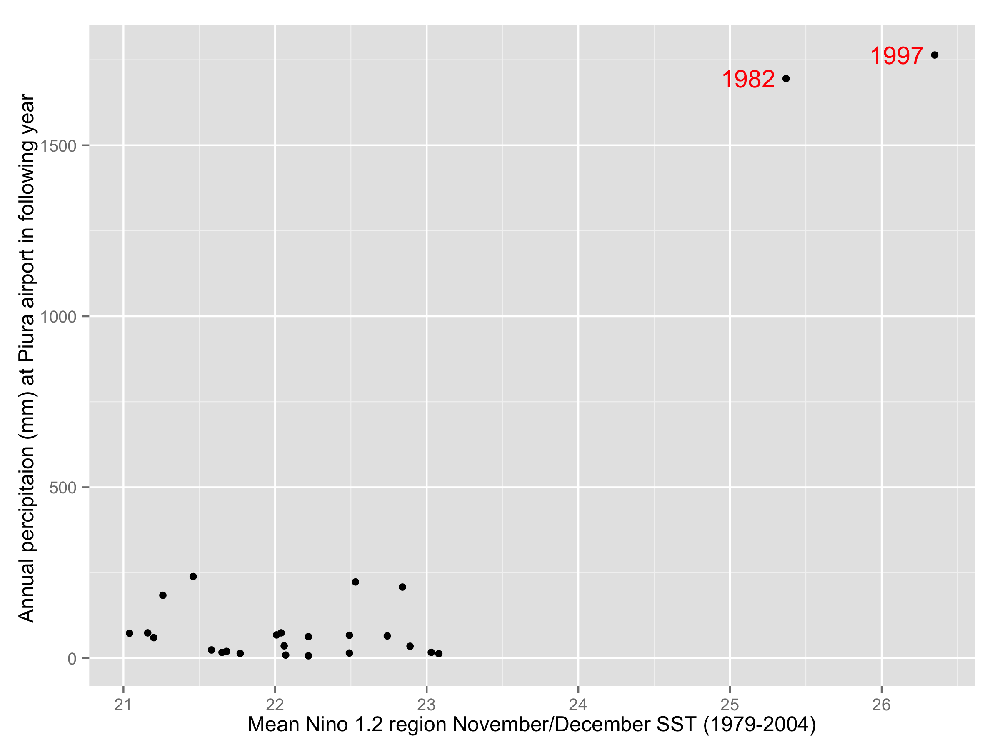
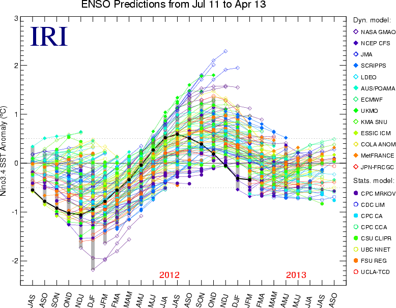
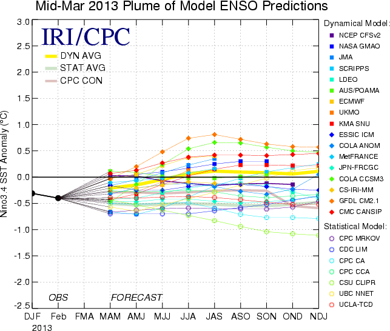

---
author:
  - name: Grant Cavanaugh, Ph.D.
    affiliation: Praedicat
    address: >
      5760 W. Jefferson
      Los Angeles, California 90016
    email: grant.cavanaugh@praedicat.com
    url: directclimatemarkets.com
  - name: Benjamin Collier, Ph.D
    affiliation: Wharton
title:
  formatted: "Developing Direct Climate Markets: Pricing Uncertainty in ENSO Forecasts"
  # If you use tex in the formatted title, also supply version without
  plain:     "Developing Direct Climate Markets: Pricing Uncertainty in ENSO Forecasts"
  # For running headers, if needed
  short:     "Direct Climate Markets"
date: "`r format(Sys.time(), '%d %B, %Y')`"
abstract: >
  Existing markets struggle to provide direct, reliable protection against longer-dated climate risks. This paper discusses how financial markets for indexes of regional climate anomalies with long-range physical and statistical links to extreme weather events, or what climate scientists call _teleconnections_, can address that market gap. Quantifying teleconnection risk requires estimating errors in regional climate forecasts. To that end, we provide a framework and tools to incubate risk trading for the best known teleconnection index, El \text{Ni\~no}-Southern Oscillation (ENSO). We suggest that the social gains from markets in teleconnection risk in general, and ENSO in particular, are high if such markets feature active trading because such trading can effectively respond to emerging information and generate actionable forecasts of climate risk.
keywords:
  # at least one keyword must be supplied
  formatted: [climate, risk, finance, insurance, ENSO]
  plain:     [climate, risk, finance, insurance, ENSO]
preamble: >
  \usepackage{amsmath}
  \usepackage{graphicx}

output: rticles::jss_article
bibliography: bibliography.bib
---

# Introduction

Financial risk management tools that manage the risk of global climate change could reduce suffering and loss, both directly, via hedging, and indirectly, by generating valuable information that can support policy [@collier2013exclusive]. However, few if any such tools are available. While there are many markets today where firms and individuals can trade or manage risk influenced by climate, it is difficult to identify existing markets that offer direct, reliable protection against longer-dated climate risks.

Among the better known traded markets with some link to climate are those for emission permits, temperature and rainfall derivatives covering major cities, and equities for companies in weather dependent industries. Similarly, there are markets for insurance and reinsurance risks, influenced by climate, that are traded by specialized institutional investors [@kurtov2010investing]. But none of these markets offer at-risk communities direct protection from climate extremes at competitive prices representing an informed forecast of global weather patterns. 

Prices on these markets are primarily driven by non-climate factors, such as policy or recent returns in bond and equity markets [@econ2013ETS; @kurtov2010investing]. This means that companies or individuals looking to hedge actual climate risk on existing markets may find that their best available proxies for climate risk bear little resemblance to their actual experience of that risk. In the language of finance, these _cross hedges_ show _high basis risk_.

Even when price in these existing markets explicitly reflect long-term climate considerations, they often fail to do so directly. This means that it is difficult to use the resulting prices to forecast climate events. Take for example, an index-based insurance settling exclusively on rainfall measured at specific weather station. Such a risk product removes practically all factors except the weather risk and its drivers, such as changing climate. So, a reinsurance company offering this protection must explicitly account for climate in their price. But, even in pricing such a simple product, a reinsurer will often use an _uncertainty load_, a heuristic to adjust their best price estimate upward to reflect uncertainty, rather than make an explicit and rigorously researched forecast of the link between climate and a localized index. 

Markets could expand to cover the indexes most assocaited with long-term global climate change, like the extent of Arctic ice or global mean surface temperatures. But many of these indexes are ill-suited to formal risk management. First, meaningful changes in these indexes unfold over a long time horizon relative to the planning horizons of commercial and public decision makers [@ipcc2013fifthReport]. That mismatch complicates climate-related collective action in general and would likely check the provision of liquidity on a traded market. Moreover, it may also pose a challenge to individual economic experts evaluating the merits of hedging climate risk [@jacquet2013intra; @nordhaus2013; @pindyck2013]. 

But even if the horizons of trends in these primary climate indicators matched the horizons over which organizations made formal risk management decisions, these indexes would be difficult to translate into forecasts of adverse climate events on a geographic scale that is actionable for individual firms and organizations. Firms tend to hedge risks through using formal financial tools only when their risk managers understand how adverse changes in the index underlying a hedge will imperil specific contractual relationships [@pennings2000motivation; @pennings2001behavioural]. Global climate models, such as those that support much of the analysis in the UN's IPCC reports, often do not include analysis with that level of geographic specificity. While there have been advances in _downscaling_, translating long-term climate models into regional forecasts, it is difficult to access their validity because of the long time horizon of the changes predicted [@fowler2007linking]. These models differ starkly from the types of models used commonly used to reinsure property against catastrophic natural disasters like hurricanes or earthquakes, which can be tested and improved on an ongoing basis. 

Finally, while the link between global climate indexes and regional weather remains uncertain, many of the tends in those global indexes are considered highly likely. For example, the [@ipcc2013fifthReport] notes with virtual certainty (a \>99\% chance) that sea level rise will continue beyond 2100. Such certainty also undermines some climate indexes' value for formal risk management. Financial risk transfer is generally not suitable for managing known outcomes but instead focuses on managing the risk around uncertain outcomes. As the saying goes, insurance is very expensive once the house is on fire. Known, or highly certain outcomes, such as sea level rise, are traditionally managed through risk mitigation (building levees, relocating populations, etc.) rather than risk transfer.

Together, the difficulties of building meaningful financial contracts directly around climate change and the basis risk inherent to managing climate risk with existing markets suggest a missing market for financial contracts that could:

* Directly cover climate risks rather than simple short-term weather indicators;
* Meet conditions associated with stable financial risk transfer flows, such as a minimum level of volatility in the underlying index [@working1953futures; @silber1981innovation; @carlton1984futures; @black1986success; @duffie1989optimal; @tashjian1995optimal; @pennings1999commodity; @brorsen2001success; @gorham12; @sandor2012]; and
* Fit within the actionable geographic scope and time horizons of decision makers attempting to prepare for a changing climate. 

This paper discusses how financial markets for indexes of regional climate anomalies with long-range physical and statistical links to extreme weather events, or what climate scientists call _teleconnections_, fit well into that market gap. 

Teleconnection risk indexes including El \text{Ni\~no}-Southern Oscillation (ENSO) and the Artic Oscillation do not suffer from the basis risk inherent to many longer range climate indicators. They can be directly and sometimes causally linked to extreme weather in specific communities. Hence these climate drivers are specific enough to worry individuals, firms, and institutions in the short-term. Yet, they are also long-dated and wide-ranging phenomenon, so they have a clearer connection to global climate change than localized weather indexes.

The analysis presented here is focused on the prospects for ENSO markets in particular, however it also addresses questions broadly applicable to risk markets sitting at the intersection of finance and science, such as: 

* When is a scientific risk well suited to direct management on a traded market?
* How can a new science-driven risk market avoid the asymmetric information problems that could undermine active trading?
* When do scientific forecasts contain financially actionable information?
* How can we incorporate multiple sources of scientific uncertainty into risk markets?
* Does a given risk have informative emerging forecasts and sufficient underlying volatility to drive active trading? 

ENSO (more specifically the Oscillation's extreme anomaly events called El \text{Ni\~no}/La \text{Ni\~na}) is a climate driver with teleconnections whose risk is already directly managed through an innovative insurance [@skees2013presser]. With support from the Gate Foundation, the authors were involved in the design, pricing, and sales of that insurance. The El \text{Ni\~no} insurance market is noteworthy in that it is the first market to directly hedge teleconnection risk and has been structured as forecast insurance - an insurance that pays based on a remotely measured geophysical event that precedes much of El \text{Ni\~no}'s physical damage. 

This new ENSO insurance provides the direct protection against regional climate anomalies. However, ENSO and other similar regional climate phenomenon with teleconnections, share some characteristics that may ultimately leave their risk more efficiently managed via traded markets. This article discusses the benefits of managing teleconnection risk on traded markets. It also discusses how ENSO risk, should it succeed in moving to a traded market, would set a precedent for a suite of markets providing a robust foundation for climate risk adaptation and mitigation strategies. Those markets would generate prices containing socially valuable forecast information.

We also introduce a pricing framework that is necessary but not sufficient to catalyze early trades those markets. This framework will give benchmark prices to risk managers seeking climate protection, even as new forecast information becomes available. Dealing with such forecast information and placing a price on the uncertainty within available forecasts is a critical hurdle for the development of robust direct climate markets. Indeed the information asymmetries associated with ENSO forecasts have complicated the sale of existing insurance against extreme El \text{Ni\~no} in Peru, which we helped design and sell with support from the Gates Foundation. 

# Identifying appropriate instruments to manage climate risks

El \text{Ni\~no}/La \text{Ni\~na} is characterized by a host of physcial characteristics that have profound implications for how the phenomena's risk can be efficiently managed:

* Simple index - ENSO anomalies are measured by a relatively simple index.
* Index anomalies linked to distinct risk events - Anomalies in SSTs translate to discrete risk outcomes that are well understood by at-risk communities.
* Spatially correlated risk - ENSO risk is spatially correlated.
* Cyclical risk - ENSO has an annual cycle.
* Forecasts have social value - Individuals and policy makers use forecasts of ENSO SST to prepare for disasters. 
* Offsetting pools of risk - ENSO is associated with potentially offsetting consequences across regions and time.
* Few opportunities for arbitrage - There are few simple, reliable proxies for ENSO risk that are/could be traded.

These characterisics (particularly the simple index, links to distinct risk events, and spatially correlated risk) allowed GlobalAgRisk to create an innovative El \text{Ni\~no} insurance [@khalil2007nino]. However, these characteristics, many of which ENSO shares with other teleconnection-linked anomalies, also suggest why ENSO risk may ultimatly be more efficiently managed through traded markets.

After a brief introduction to ENSO, we discuss each of these characteristics individually and how they favor some risk management solutions, such as exchange-traded derivatives or catastrophe bonds, over others. Given the qualitative similarity between ENSO and other teleconnection indexes, the following section provides a general framework for choosing the appropriate financial instruments for any direct climate market.

## Introduction to ENSO risk

ENSO refers to a coupled oceanic/atmospheric cycle. In normal years, the cycle follows currents and winds (each reinforcing the other) as they bring water along the surface of the Pacific Ocean from South America (the eastern side of the Pacific) to Indonesian and the South Pacific (the western side of the Pacific). As that water travels along the ocean surface, it warms. The resulting mass of warm water sinks as it arrives in the western Pacific and begins circulating back toward Peru along the cold ocean floor. The cycle ends with cold water rising to the surface in the eastern Pacific, sustaining rich fishing grounds off the coast of Peru and Chile [@clarke2008introduction]. 

During an El \text{Ni\~no} anomaly, this cycle weakens. Usually starting in March or April, a plume of warmer-than-normal water creeps eastward across the Pacific, lessening the normal temperature gradient from the Western to the Eastern Pacific. When that plume of warmer-than-normal water reaches Peru, usually by January, it parks a moisture laden air mass off the South American coast. When that mass air  meets the cold air descending from the Andes, it causes an extended period of torrential rains and flooding in northern Peru and southern Ecuador [@lagos2008nino]. 

By contrast, during a La \text{Ni\~na} anomaly the normal cycle enhances. More water gets pushed from the South American coast, raising sea-surface temperatures in Australia and Indonesia above normal. That leaves Southeast Asia and Oceania with increased incidence of extreme rains and flooding [@chiew1998nino].

## Simple index

National Meteorological Services (NMS) monitor El \text{Ni\~no}/La \text{Ni\~na} by measuring sea-surface temperatures (SST) over defined regions of the Pacific Ocean. That means that the the phenomenon can be accurately expressed using freely available data, provided in simple-to-understand units (degrees centigrade), according to a methodology that is well defined [@khalil2007nino]. These qualities are attractive to prospective market speculators (those that might offer El \text{Ni\~no} protection in exchange for an expected profit), because they mitigate many of the moral hazard and adverse selection problems inherent to traditional insurance [@skees1997designing]. 

Catastrophic risk professionals would welcome the opportunity to price protection using the simple, reliable, and inexpensive data that describe ENSO and many other teleconnection indexes. Both the realized and opportunity costs of writing that protection are low compared to most catastrophic risks, which tend to be inherently multi-variate [@woo1999mathematics]. Hurricane risk for example, even represented as a standardized index, requires estimates of windspeeds, storm track, and the time that a storm will spend over a given area [@cmehurricane]. This is sufficiently complicated that even sophisticated hedge funds specializing in catastrophic risk rely on third-party catastrophe models from specialist firms like RMS, AIR Worldwide, and EQECAT. 

The simplicity of ENSO SST indexes facilitated the launch of GlobalAgRisk's initial insurance, allowing reinsurers to confidently price protection using only the expertise of their existing modelers. If indeed the risk eventually moves to traded markets, the same simplicity will allow new speculators interested in selling protection for an expected profit to enter the market quickly.


## Index anomalies linked to distinct risk events

While speculators' prefer to sell protection on simple and reliable indexes, those characteristics are not enough to drive hedgers (those looking to transfer risk for expected loss) to use a new risk market. To entice hedgers a risk market's underlying index must correspond tightly to hedgers' risk perceptions [@ederington1979hedging]. That is indeed the case for NOAA's SST indexes. Anomalies in SSTs translate to discrete risk outcomes that are well understood by at-risk communities.

Perceived basis risk is particularly low for Peruvian hedgers managing the risk of catastrophic flooding in the country's Northern region using SST measurements from the \text{Ni\~no} 1.2 region, directly off the Peruvian coast as shown in figure \ref{fig:ninoareas}. In fact, the high SSTs measured by NOAA's various indexes are the immediate physical cause of flooding, so the link between the index and risk outcomes is more a simple statistical association [@khalil2007nino].

```{r echo=FALSE , eval=FALSE}
#  
```

\begin{figure}
  \includegraphics[width=\linewidth]{img/region_map.png}
  \caption{NOAA's \text{Ni\~no} SST regions}
  \label{fig:ninoareas}
\end{figure}

That link between high SSTs and rainfall is dramatic. In figure \ref{fig:pptInPiura} _need to reproduce_ we see that rainfall in northern Peru during the last severe El \text{Ni\~no} in 1998 was 40 times normal for January to May [@skees2009enso]. This event caused widescale internal displacement of people, loss of life, increases water-born illnesses, disruptions to markets and supply chains, and destruction of personal property and critical infrastructure [@rosenzweig2008climate].  There were similarly alarming impacts from the 1983 El \text{Ni\~no} which was also linked to the economic collapse of the country's fishing industry [@glantz1991teleconnections; @aranda2009evolution].

```{r echo=FALSE , eval=FALSE}
# 
```

\begin{figure}
  \includegraphics[width=\linewidth]{img/piuraPptScatter.png}
  \caption{Mean Nino 1.2 region November/December SST (1979-2004) vs. annual percipitaion (mm) at Piura airport in following year (data from Mario Miranda and Jerry Skees)}
  \label{fig:pptInPiura}
\end{figure}

Importantly from the standpoint of a hedger evaluating basis risk, both of those extreme anomaly years stand out in \text{Ni\~no} SST time series. The spikes in that index correspond so well to the years popularly associated with catastrophic El \text{Ni\~no}, that most hedgers expressed satisfaction that they would receive some payment should another catastrophic El \text{Ni\~no} occur.

## Spatially correlated risk

Car accidents provide a simple example of a _pooled risk_.Everyday that a driver does not get into an accident, they are implicitly paying car insurance premiums that go into a pool used to pay the claims of the few drivers that did get into an accident that day. Historically, the price of insurance on such pooled risks is strongly linked to underlying expected loss [@cummins1992controlling]. This leaves little room for efficiency improvement through trading. 

However, spatially correlated risks like El \text{Ni\~no} cannot be pooled [@skees2007using]. The vast majority of Peruvians facing El \text{Ni\~no} risk experience that risk at the same time - every year will either bring a catastrophic El \text{Ni\~no}, against which they would like protection, or it will not. 

Within the world of insurance, spatially correlated risk tend to pass to reinsurance companies - companies who have enough capital to payout huge claims at a moments notice. These companies ostensibly pool their risks across the globe - balancing, for example, US hurricane risk in a portfolio with Turkish earthquake risk. However, in practice, their portfolios are highly concentrated and their business model involves accepting catastrophic risk in exchange expected profits that are multiples of the underlying risk. (Estimates of industry-wide pricing to risk ratios are avaliable through periodic publications by brokers such as @schultz2012, @willis201ils, and @swiss2012update. One plausible explanation of persistently high reinsurance prices is that the supply of large capital reserves required in reinsurance are constrained [@froot2001market]. 
                                                                                                                                                                                                                                                                                                                                                                                                                                                                                                                                          
                                                                                                                                                                                                                                                                                                                                                                                                                                                                                                                                          Industry experts have long believed that the unpoolable risk in reinsurance markets could be managed more efficiently in traded markets, where groups of speculators could replace large reinsurers and competition among those speculators would drive prices down [@sandor2012]. Almost two decades after the first experiments moving reinsurance risk to traded markets, that _convergence_ between reinsurance and broader financial markets appears to be underway, with reinsurers reporting that recent falls in prices have been driven by outside pools of risk capital [@schultz2012; @willis201ils; @swiss2012update]. From the standpoint of ENSO and other teleconnection risks, this convergence suggests that traded markets are a viable and potentially efficient avenue for managing risks that might otherwise go to reinsurance markets.

## Cyclical risk

El \text{Ni\~no}/La \text{Ni\~na} emerge in the latter months of the calendar year. That annual cycle allowed GlobalAgRisk to construct an innovative insurance that offeres payouts in advanace of the floods that are the chief concern for at-risk Peruvians. However, ENSO's annual cycle also poses informational challenges to any potential ENSO risk markets. 

High SSTs in specific months define El \text{Ni\~no}/La \text{Ni\~na}. But those high SSTs precede the rains they cause. GlobalAgRisk's El \text{Ni\~no} insurance takes advantage of this lag. It makes payments using November and December ocean temperatures, which predate the severe rains and flooding that have historically begun in late January/early February. That lag means the insurance payments could be used for loss mitigation and adaptation. That innovative feature is understandably attractive to buyers [@khalil2007nino]. However, it rests on the fact that ENSO risk can be forecast, which itself is problematic for speculators. 

Sustained Pacific temperature anomalies build up over months, with the cycle of build-up generally reset at the end of the Northern Hemisphere winter. Each year starting in March, current temperature readings that are warmer or colder than normal SSTs provide probabilistic information about the temperatures that we will see in the critical months later in the ENSO season that define El \text{Ni\~no}/La \text{Ni\~na}. The signal provided by those current SSTs strengthens throughout the year, such that forecasts are less reliable in April than they are in June [@clarke2008introduction]. 

That creates a problem for speculators in ENSO risk. If buyers are particularly skilled at forecasting SSTs, they may buy ENSO protection only in those years when they are likely to enjoy a payout. That type of herding behavior is known in insurance markets as adverse selection and (re)insurance companies try to avoid it by setting their _sales closing date_, the last date on which buyers can commit to an insurance arrangement, well in advance of the time when actionable forecasts emerge.In other words, (re)insurers refuse to participate in risk trades where they believe it is necessary to condition historical prices on current forecasts.

When El \text{Ni\~no} insurance first came on the market in Peru, the sales closing date was set in March. While this was near the _spring predictive barrier_ in the ENSO cycle, the reinsurer backing the product was not satisfied that the sales closing date preceded all actionable forecasts. In subsequent seasons, the sales closing date for GlobalAgRisk's insurance was pushed back to January, almost a full year before the period of coverage [@cavanaugh2010incorporating].

This schedule avoids the adverse selection problems created by El \text{Ni\~no} forecasts, but it also limits participation in this market. For some firms, the high opportunity cost of purchasing insurance so far in advance is too great. For others, the rigid and long-dated sales parameters conflict with existing budget cycles. Those problems will only grow over time as forecasting likely continues to improve, requiring earlier and earlier sales closing dates.

Multi-year insurance agreements might alleviate the threat of adverse selection linked to ENSO forecasts, at least for the latter years of those contracts since even ambitious forecasts forecasts rarely claim to extend beyond a year. They will also smooth insurance demand in a market where many policyholders might fail to renew their policies in the year (or several years) following a severe event, believing that neutral or La \text{Ni\~na} events naturally follow El \text{Ni\~no}. That belief is not well founded in historic records, but it is common enough to produce fluctuations in demand that might discourage insurers and brokers, who build their business on automatic renewals.

But multi-year contracts only exacerbate the opportunity cost problem facing insurance buyers. Not only will they require buyers to make a decision on the insurance and lock up premiums ahead of forecasts for the front year of the contract, but they will also have to lock up premiums for the latter years of the contract. Moreover, reinsurance and related markets rarely offer standardized risk transfer agreements that extend beyond a year. (Some industry experts have reported that reinsurers have reluctantly begun to offer multi-year policies in response to recent competitive pressures [@artemis2014terms]. However, catastrophe bonds, which remain among the longer dated relevant contract types generally extend out  three years, and only rarely more than five [@kurtov2010investing].)

On traded markets, prices for protection move to reflect new forecast information as it becomes available. With such dynamic pricing of ENSO risk, buyers could enter and exist hedges at their convenience assuming that most of the private information available to the market has already been incorporated into prices. If any trader identifies a mis-pricing with high confidence, they can use leverage to magnify the returns to their private information. That type of aggressive speculation should theoretically limit the scale of information asymmetries faced by future hedgers.

To be sure, adverse selection can undermine liquidity in traded markets, just as in insurance markets [@copeland1983information; @glosten1985bid; @kyle1985continuous; @leland1992insider]. However, traded markets routinely incorporate the type of probabilistic  information contained in ENSO forecasts without incident. While it is theoretically possible for insurance companies to offer dynamic pricing of risks similar to a traded market, the firm offering such prices would bear all of the adverse selection risk in that market.

## Forecasts have social value
When first presented with GlobalAgRisk's El \text{Ni\~no} protection, Peruvians regulators debated whether the product should be regulated as a derivative or as an insurance. Quickly, they decided that the product should be an insurance because Peruvians had an _insurable interest_ in the proposed policies - they routinely saw forecasts of ENSO SST index anomalies in the media and incurred costs preparing for impending disaster based on those forecasts. So, even before formal El \text{Ni\~no} protection was available, forecasts of indexes of the risk were demonstrating clear social value by driving economic decisions.

Like any risk trade, insurance prices could to contribute to the process of disseminating actionable forecast information. But, as discussed above, reinsurance companies rarely offer conditional pricing on risks like ENSO that emerge over time. Even if they did insurance policies often include provisions baring purchasers of protection from revealing the price they received. So many industry practices limit the contribution of insurance transactions to public forecast information.

By contrast, traded markets have a long history not just of reacting to new information, like ENSO forecasts, but anticipating and synthesizing those forecasts into a single reliable signal that can guide economic decision making. Looking at a market with clear ties to teleconnection risk, @chincarini2011no found that  weather derivatives prices, even for thinly traded contracts, provide a reliable benchmarks for prediction. @roll1984orange identifies instances when orange juice concentrate futures have price movements anticipate severe weather forecasts before they were released by the U.S. National Weather Service. 

In the case of ENSO, prices from traded markets will be valuable precisely because there is so much publicly available forecasting. Hedgers find it difficult to process competing forecasts in the absence of definitive baseline reference points, like the prices from markets. In any given month, some NMS predict looming catastrophe while others tell hedgers not to worry. Figure \ref{fig:IRIENSOconsensusSpread} provides a sense of the range of forecasts throughout 2012, a year in which conditions were ultimately normal. In early 2012 some models predicted historically strong El \text{Ni\~no} while others suggested a light La \text{Ni\~na}.

```{r echo=FALSE, eval=FALSE}
# 
```

\begin{figure}
  \includegraphics[width=\linewidth]{img/all_forecasts_IRI_04_2013.png}
  \caption{Forecasts of ENSO index anomalies between July 2011 and April 2013 compiled by Columbia University's International Research Institute for Climate and Society \url{http://portal.iri.columbia.edu/}}
  \label{fig:IRIENSOconsensusSpread}
\end{figure}

Researchers are comfortable harnessing that disagreement among models to provide ensemble forecasts [@coelho2004forecast; @luo2007bayesian]. But, Peruvian hedgers repeatedly expressed confusion linked to the proliferation of ENSO forecasts in meetings with GlobalAgRisk. In particular, some hedgers came to mistaken conclusion that relatively mild years for \text{Ni\~no} SST were actually extreme El \text{Ni\~no} years based on individual forecasts. That confusion about past ENSO forecast may have reprocussions for future preparedness. @gladwin1997warning found that individual who survived a hurricane were actually less likely to evacuate when threatened by subsequent large storms.

In the context of proliferating forecasts, a single concensus forecast (in the form of a price for protection) may be particularly valuable to at-risk individuals. Given the link between ENSO and the wider process of global climate change, forecasts from ENSO markets may also provide valuable, if indirect, forecasts for global weather patterns beyond the regions traditionally associated with ENSO.

## Offsetting pools of risk

Early work on ENSO risk management has focused on Peru. But, teleconnections, like ENSO, inherently link disparate groups of hedgers across the globe. Where Peruvians see El \text{Ni\~no} anomalies as harbingers of disaster, American insurers see them as an indicator of strong underwriting profits thanks to a decreased likelihood of major Atlantic hurricanes [@klotzbach2011nino]. @ropelewski1987global and @ropelewski1989precipitation, seminal academic articles at the heart of our current understanding of ENSO, identify many far-flung regions (19 for El \text{Ni\~no} and 15 for La \text{Ni\~na}) where precipitation has a statistically significant link to the ENSO cycle.

In theory, the diversity of ENSO's impacts across time and space means that hedgers with offsetting risk profiles could directly trade risk with one another. Relative to a _one-sided_ market, like reinsurance, where a speculator (reinsurer) sets a price above expected loss that a hedger can take or leave, direct trades between hedgers would improve social welfare in the short-run. 

In a direct trade, each hedger is willing to transact with little or no expected profit because the trade would improve their risk profile. Such _two-sided_ markets, where buyers and sellers simultaneously negotiate, would also allow firms with strong forecasts of ENSO to enter the market as buyers or sellers, depending on prevailing prices. Hence, a two-sided ENSO market would have two important short-run advantages realtive to simple reinsurance: 


* hedgers could cost-effectivly achieve a given risk profile;
* natrual hedgers and speculators could both contribute to price discovery.

While these advantages would not persist in a perfectly competetive marketplace, market frictions are a long-standing empricial reality in reinsurance. Reinsurers have enjoyed high expected profits for decades and the distinction between reinsurance buyer and seller is enforced through regulation [@froot1999financing]. 

To be sure, a one-sided market is perfectly appropriate for some types of risks. For example, hedging interest in earthquake risk is naturally _unbalanced_. There is no large group of firms that benefits from an earthquake and would consequently be willing to accept earthquake losses at no expected profit. A two-sided market in eaerthquake risk would quickly reduce to a one-sided market, with all hedgers buying protection from speculators. However, teleconnection risk is natually balanced. That means that its markets would enjoy a rare and valuable advantage as they attempt to establish liquidity in a two-sided format (e.g. derivatives, traded securities, etc.) [@gray1978does; @tashjian1995optimal] which in turn promises low-cost and informationally efficient trading in the short-run.

## There are few simple, reliable proxies for ENSO risk

The last important quality to note about ENSO risk is that it is not a simple combination of other common risks nor is it a risk that can be recreated physically. The ability to recreate a risk (physically or statistically) is a prerequisite for arbitrage pricing formulas. Those formulas can be helpful to a new market looking to reach sustainable liquidity because they provide a stable reference price for transactions. However, easy opportunities for arbitrage can also obviate the need for a dedicated risk markets. Why hedge on a new illiquid market when an existing liquid market offers very similar hedges? 

Taken togeather, these factors suggest that:

* There is an opportunity for ENSO and other teleconnection risk markets because they would not be redundant; however,
* Taking advantage of that opportunity will require simple pricing huristics that can take the place of an arbitrage formula.

We cannot store sea surface temperates, atmospheric patterns, or any of the defining charateristics of regional climate anomalies. This rules out physical arbitrage for teleconnection risk. It is also difficult to find strong statistical _cross-hedges_ for teleconnect risks. For example, industry experts may note that ENSO is linked to poor growing conditions for cocoa in West Africa and high summer temperatures in Houston [@ft2012; @ercot2014]. They may subsequently use ENSO information to trade on cocoa futures and Texas electricity markets. However, it would be very difficult to use a basket of cocoa and electricity to reconstruct an index of ENSO.

The absence of arbitrage, suggests first that ENSO risk should be managed on dedicated markets. Second, it also suggests the need for simple and reliable reference prices based on historical information to catalyze risk trades. In many markets, arbitrage pricing formulas help catalyze trades by lowering the analytical barriers to entry and limiting the scale of information asymmetries [@scholes1998derivatives]. Traders place a particular emphasis on arbitrage based reference prices because they tend to have strong theoretical underpinnings and the prices they produce can be enforced through simple trading strategies.

Nevertheless, in circumstances where there is no reliable arbitrage, pricing frameworks based purely on historical data are the best available alternative and are often quite effective at approximating arbitrage pricing and thereby eliminating gross inefficiencies in a market [@haug2011option]. In the latter sections of this article, we present such a framework.

# Pricing direct climate risk

The remainder of this article focuses on the data and decision-making hurdles surrounding the launch of traded risk markets on teleconnection index risk. 

Again we focus on ENSO, for which we:

* identify NOAA's monthly SST from the \text{Ni\~no} 3.4 region compiled using the ERSST 3b methodology as the most promising of the candidate ENSO SST indexes for contract settlement; 
* approximate a fair price for risk transfer conditional on available forecasts when no arbitrage is available; and,
* use prices and historical data to identify key times in the ENSO cycle in which trading is likely to concentrate.

Having identified two-sided markets as an end goal, the remainder of this article focuses on practical concerns regarding the launch of those markets. This analysis is not only necessary to support sustained ENSO risk trading, but will be important for the related climate-linked markets that follow in its wake.

# Choosing a index
There are multiple SST datasets that could settle ENSO risk transfer contracts. In this section we explain why NOAA's monthly SST from the \text{Ni\~no} 3.4 region compiled using the ERSST 3b methodology is a particularly strong candidate to settle traded risk contracts. 

We arrive at this conclusion after considering the a series of questions that distinguish NOAA's SST datasets from one another:

* Which methodology does it use?
* Which region does it cover?
* In what form are the SSTs presented? 
    + As absolute degrees or anomalies? 
    + As individual monthly measures or as values smoothed across rolling windows?

## Choosing a methodology
NOAA publishes two primary sea surface temperate indexes. Figure \ref{fig:baeslinesOIER} provides the monthly values that NOAA uses to calibrate anomalies in each. NOAA's Extended Reconstructed Sea Surface Temperature Index (ERSST) dataset provides a longer record compiled using in-situ buoy measurement. NOAA's satellite-based Optimum Interpolation Sea Surface Temperature Index (OISST) offers finer resolution. While they are compiled using distinct methodologies, both indexes agree when identifying extreme El \text{Ni\~no}/La \text{Ni\~na} events. Given its longer record, the conceptual simplicity of in-situ data collection, and the documented bias of the OISST methodology toward colder temperatures, we favor the use of ERSST as the basis of financial contracts. However, the cost and reliability of ERSST buoys may guide NMS toward greater reliance on OISST. In either case, the financial considerations outline here remain the same.

```{r echo =FALSE, eval=FALSE}
# 
```

\begin{figure}[!htbp]
\begin{center}
  \includegraphics[width=\linewidth]{img/CompareOISSTandERRSTbaselines.pdf}
  \caption{Comparing OISST and ERSST monthly baselines}
   \label{fig:baeslinesOIER}
   \end{center}
\end{figure}

The key factor distinguishing ERSST from OISST is the use of in-situ and satellite data. ERSST exclusively uses in-situ measurement, primarily that consists of temperature readings taken by a network of buoys throughout the Pacific (which are now communicated via satellite) [@smith2004improved; @smith2003extended; @smith2008improvements]. Monthly anomalies in the ERSST version 3b index are measured relative to a 1971-2000 base period with a resolution of two degrees across the four ENSO regions [@xue2003interdecadal]. While the primary index record that NOAA posts to its websites goes back to 1950, monthly ERSST data are available from 1854 on.

OISST, currently at version 2, combines in-situ SST measurements, daytime and nighttime satellite data readings, and data from sea ice cover simulations. The satellite-measured data, whose collection began in the early 1980s, is adjusted statistically for natural sources of bias, like cloud cover and atmospheric water vapor [@reynolds2002improved; @reynolds1994improved; @reynolds1993improved; @reynolds1988real]. 

Finance professionals require reliability, simplicity, and prefer a long track record for their settlement indexes. Neither ERSST nor OISST has a clear advantage across all three dimensions. 

ERSST relies on data that is relatively simple for non-experts to grasp - buoys take temperature readings at regular intervals and relay that information via satellite. Indeed, that is the reason that the GlobalAgRisk team used ERSST data to price its El \text{Ni\~no} insurance. By contrast, OISST combines data from multiple sources in a procedure that requires some advanced climate and statistical knowledge to parse. 

However, ERSST's buoys are subject to a higher risk of physical damage than the remote measurement tools used for OISST. When a buoy is offline, NOAA uses statistical techniques to infer data from surrounding buoys. This means that in practice the integrity of ERSST's underlying data may be lower and the index may ultimately rely equally on statistical procedures obscure to new hedgers.

The reason that we believe that ERSST is ultimately a better index for financial contract settlement is its age. ERSST simply offers a longer time series for price analysis. Using ERSST, gives practitioners almost thirty-five additional historical data points for any given month. Those extra data points provide everyone involved with a great deal more confidence in their pricing models. 

## Choosing a region

\text{Ni\~no} 1.2 is the best predictor of catastrophic flooding in Peru and Ecuador consequently it was the basis for the existing El \text{Ni\~no}'s insurance [@khalil2007nino]. However, NMS generally mark global ENSO anomalies using the \text{Ni\~no} 3.4 region, which stretches across the central Pacific [@barnston1997documentation]. Both regions, \text{Ni\~no} 1.2 and the \text{Ni\~no} 3.4, have a very high correlation during extreme anomalies. But \text{Ni\~no} 3.4 is generally considered a better proxy for the worldwide teleconnections associated with ENSO. In particular, it does a better job capturing ENSO anomalies with distinct geographic signatures. During the 1972/1973 El \text{Ni\~no}, for example, most of the sea-surface temperature warming occurred in the central Pacific, closer to the \text{Ni\~no} 3.4 region. El \text{Ni\~no} events focused on the Central Pacific are also called _Modoki_ \text{Ni\~no}s and can have large global impacts [@ashok2007nino].

## Choosing a format

After selecting a settlement index, market innovators must also choose the format in which settlement numbers will be presented to traders. In the case of ENSO, that choice centers on the question of whether to use: 

* Anomalies (degree Celsius departures from monthly averages) or absolute degrees Celsius; and,
* Simple monthly values or moving averages, with for example, a three month window.

It is not immediately clear whether anomalies or absolute degrees offer a better base for financial contracts. Early potential market participants interviewed in [@cavanaugh2013interviews] were split or indifferent on this question.

The work here is presented in terms of absolute values to mirror the format of the existing El \text{Ni\~no} insurance. However, most major meteorological organizations define El \text{Ni\~no}/La \text{Ni\~na} events in terms of persistent monthly anomalies. Indeed, many forecasts of SSTs (like those from the ABM and IRI) are only provided in terms of anomalies. So, early traders may feel more comfortable thinking in terms of anomalies.

The primary disadvantage of anomalies is that they can obscure changes over time because they are based on averages from a rolling window (e.g, using data from the previous 20 years). Those baselines have been, and will continue to be, subject to revision as underlying SSTs drift over time. This means, for example, that a 2 degree positive anomaly in October relative to the current baseline may and likely will be different in absolute temperature than a 2 degree positive anomaly in October twenty years from now. 

That shift in baseline SSTs, likely driven by global climate change, is one of the areas where market forecasts could inform public policy. It is marginally obscured by using anomalies with changing baselines. For example, if climate change increases the mean of ocean temperatures, the terms of a relative contract would also adjust. So, trading in 2016 and 2030 might both center on a one degree anomaly, but the baseline defining that anomaly might change. To a naive observer, this might look like a twenty year period in which traders did not price in any change in the underlying climate. Using absolute temperatures, traders could easily express theories about the long-term trends in the index in a way that is simple and clear to uninformed observers. 

In either case, the choice between anomalies and absolute units is one of convenience. It is not integral to the success of the market. Many weather derivative routinely use annually revised baselines.

By contrast, the choice between using individual monthly values and multi-month averages is more straight-forward. Multi-month averaged indexes are commonly used by NMS to define ENSO. (GlobalAgRisk's existing insurance settles on a multi-month average.) But single month contracts would offer traders greater flexibility as they attempt to profit from fine-resolution forecasts. If there were traded markets on monthly values, it would be trivial to combine them and create a positions that mirror multi-month indexes.

# Developing a prototypical contract

Given a target index, we now begin the process of pricing contracts on that index built around the needs of hedgers. That process involves:

* Choosing a pricing function to convert index values into financial obligations;
* Running historical values through that pricing function, and 
* Fitting a distribution to historical values to generate prices that reflect the underlying statistical process of ENSO.

Based on the recommendation of Dr. Andrew Watkins of the Australian Bureau of Meteorology (ABM) we have chosen October as our example month, because October values of \text{Ni\~no} 3.4 tend to be critical in identifying El \text{Ni\~no}/La \text{Ni\~na} worldwide.

## Pricing function

Severe El \text{Ni\~no} and La \text{Ni\~na} events imperil existing business arrangements and are likely to drive early hedging. Given that, we have focused on financial contracts that are well-suited to representing extreme risk such as options. In particular, we focus on option spreads, option positions that mirror many insurance payouts.

Options have _triggers_, index values that mark the start and end of contingent liabilities. We have selected triggers of one and three standard deviations away from the monthly mean. Payments on our example options begin at one standard deviation above (for an option spread covering El \text{Ni\~no}) or below (for an option spread covering La \text{Ni\~na}) the monthly average. Payments reach one hundred percent of the notional value (or sum insured) at three standard deviations above or below the monthly average for El \text{Ni\~no} and La \text{Ni\~na} contracts respectively. Figure \ref{fig:optionParamsByMonth} shows the average monthly value for \text{Ni\~no} 3.4 in black. The red and blue bands show the index values for each month that would trigger a payment on El \text{Ni\~no} and La \text{Ni\~na} respectively.

```{r echo=FALSE, eval=FALSE}
# 
# \label{fig:optionParamsByMonth}
```

\begin{figure}[!htbp]
  \includegraphics[width=\linewidth]{img/optionParamsByMonth.pdf}
  \caption{Index values for El \text{Ni\~no} (red) and La \text{Ni\~na} (blue) events between one and three standard deviations away from monthly average}
   \label{fig:optionParamsByMonth}
\end{figure}

Within those ranges, we use linear pricing such that an index value halfway across the red band in figure \ref{fig:optionParamsByMonth} (i.e. halfway between the the trigger and max payout point) would obligate a payout that is half of the max payout (sum insured, in insurance terms) on a El \text{Ni\~no} contract. The full linear function for October El \text{Ni\~no} is shown in figure \ref{fig:payouyt10callex}. 

Equation \ref{eq:calloption} represents the payout function for a long call option spread on a monthly SST index. Long call option spreads pay out to the hedger in circumstances where the underlying index increases, hence they provide El \text{Ni\~no} protection, in this context. $t$ is the monthly temperature. For all the following examples we have chosen October. $a$ is the attachment point which in the following examples is set at one standard deviation above the mean. For October the attachment point for El \text{Ni\~no} protection is $27.76^{\circ}\mathrm{C}$. $b$ is the exhaustion point, after which payments do not increase. It is set at three standard deviations above the mean in all El \text{Ni\~no} protection examples, or $29.72^{\circ}\mathrm{C}$ for October. (Note, that the attachment and exhaustion points that define an options trade are collectively called strikes.) This function is shown graphically in figure \ref{fig:payouyt10callex}.

\begin{equation}
 F(t)=\left \{ \begin{array} {ll}
0 & \text{if} \,\, t \le a \\
\frac{t-a}{b-a} & \text{if} \,\, a<t<b\\
1 & \text{if} \,\, t \ge b\\
\end{array} \right.
\label{eq:calloption}
\end{equation}


```{r echo=FALSE, eval=FALSE}
# 
# \label{fig:payouyt10callex}
```
\begin{figure}[!htbp]
  \includegraphics[width=\linewidth]{img/payoutExamplemonth10contractType1.pdf}
  \caption{Payout function for long call option spread (equivalent to El \text{Ni\~no} coverage) on October SST for \text{Ni\~no} 3.4 ERSST.3b trigged by index values between one and three standard deviations above the monthly baseline.}
   \label{fig:payouyt10callex}
\end{figure}

As an example, suppose that a Peruvian bank bought USD $100$ of coverage against October El \text{Ni\~no}. If actual October SST was halfway across the red band, or $28.74^{\circ}\mathrm{C}$, the bank would receive USD $50$. Figure \ref{fig:Compare1} shows the obligations triggered by historic El \text{Ni\~no} events (measured in October) if they were covered by this type of long call option spreads. These loss estimates are equivalent to what is called in insurance a _burn rate_.


```{r echo=FALSE, eval=FALSE}
# 
# \label{fig:Compare1}
```

\begin{figure}[!htbp]
  \includegraphics[width=\linewidth]{img/payoutBurnPlotmonth10contractType1.pdf}
  \caption{Historical burn on long call option spread for October SST for \text{Ni\~no} 3.4 ERSST.3b covering index values between one and three standard deviations above the baseline}
   \label{fig:Compare1}
\end{figure}

In practice, GlobalAgRisk found that hedgers (and speculators) prefer a payout function that offers a minimum payout in the event that the index reaches just above the trigger. For example, an index value that just barely crosses into the red in figure \ref{fig:optionParamsByMonth} might trigger a payout of $5$ percent on an El \text{Ni\~no} contract, rather than the tiny payout suggested the kind of linear function in figure \ref{fig:payouyt10callex}.

## Distribution

Figure \ref{fig:optionPricesWithVariousDistMonth} provides month by month expected prices El \text{Ni\~no} protection between one and three standard deviations. (They are are unconditional on forecasts meaning that they are equivalent to actuarially-fair insurance prices offered prior to an insurance sales closing date.) They are denominated in USD of premium per USD 100 of nominal coverage. The figure includes historical burn prices, prices generates using non-parametric kernel density smoother fit to historical data, as well as prices based on various distributional fits [@jewson2005weather].

```{r echo=FALSE, eval=FALSE}
# 
# \label{fig:optionPricesWithVariousDistMonth}
```

\begin{figure}[!htbp]
  \includegraphics[width=\linewidth]{img/optionPricesWithVariousDistMonth.pdf}
  \caption{Expected price for options on \text{Ni\~no} 3.4 by month, based on simulations from various distributions}
   \label{fig:optionPricesWithVariousDistMonth}
\end{figure}

The prices in figure \ref{fig:optionPricesWithVariousDistMonth} appear, with one prominent exception [^1], close to one another. However, they remain far enough apart that hedgers would certainly notice a difference between the prices offered by speculators insisting on the most conservative pricing assumptions and those of speculators willing to offer coverage at prices matching some weighted model average. On the El \text{Ni\~no} side, the highest and lowest prices are generally within 125 basis points (1.25 percent) of one another in any given month. On the La \text{Ni\~na} side, that spread is slightly larger at roughly 150 basis point, but only between April and June. 

[^1]: The prices from the Weibull samples are clearly distinct from the rest of the group - almost doubling the price of La \text{Ni\~na} coverage relative to the rest of the group. That is understandable given the distribution's heavy left tail. There is no indication that the process generating ENSO SST has a heavy left tail, so the distribution may not be appropriate here.

Based on recent estimates of the risk premium on _off-peak_ risks in catastrophe bond markets (those risks which are rarely managed in catastrophe bond markets and thus are valued for their diversification benefits), speculators demand a somewhere between 200 and 400 basis points above expected loss [@willis201ils]. Using that benchmark, an October option position covering El \text{Ni\~no} events between one and three standard deviations from the monthly baseline priced using the normal distribution might cost roughly 675 basis points. The same position priced using a kernel density smoother might cost 800 basis points, almost 20 percent higher. 

The implied price difference illustrates two important points for climate scientists looking to encourage the development of markets for protection against the risks they study. First, distributional assumptions have important economic consequences for risk markets settling on direct climate indexes. In the case of ENSO, there is past climate literature using a normal distribution to model ENSO. As we discuss in the next section, we follow that precedence here while allowing room for key modeling parameters to shift across a large search space. However, further research on the appropriate distributions for pricing climate risks will expedite the formation of stable, active risk markets.

# Pricing ENSO risk contingent on available forecasts
Extreme El \text{Ni\~no}/La \text{Ni\~na} events emerge over time, with forecasts giving us ever more reliable information in the months leading up to a given event changing the beliefs of ENSO watchers. Theoretically, a two-sided market in ENSO risk will quickly reflect those changing beliefs and provide welfare enhancing forecast information to the public through its prices. In practice, ENSO's emerging risk profile could also create informational asymmetries that undermine trading.

Publicly available pricing benchmarks would undermine such informational asymmetries. With a strong pricing benchmark, such as an arbitrage pricing formula, some highly specialize traders may still retain a consistent edge over relatively naive traders, but the scope of that edge is checked by public information. As long as it remains sufficiently narrow, hedgers will remain in the market despite fears that they are at an informational disadvantage. 

This section provides such a benchmark. We present statistical simulations of monthly \text{Ni\~no} 3.4 sea surface temperatures conditioned on average forecasts released by Colombia University's International Research Institute for Climate and Society (IRI). We use those simulations to update the prices of risk management contracts as new forecast information becomes available.

## Forecasts of ENSO SSTs

Before discussing the statistical treatment of forecasts, it is worth quickly reviewing the ENSO SST forecasts provided by IRI because those forecasts are offered in a format that is not directly comparable to the format we believe is most appropriate for traded \text{Ni\~no} risk protection. 

Every month since mid-2002, IRI has collected forecasts issued by major centers of climatological research. Figure \ref{fig:forecastExamples} shows IRI the forecasts as of March 2013.


```{r echo=FALSE, eval=FALSE}
# 
```
\begin{figure}
  \begin{center}
  \includegraphics[width=.5\linewidth]{img/SST_table_march_ex.png}
  \caption{Example of IRI's collected forecasts - March 2013}
   \label{fig:forecastExamples}
   \end{center}
\end{figure}

IRI provides \text{Ni\~no} 3.4 anomaly SST forecasts over three month rolling windows. As discussed previously, monthly SSTs are likely better suited to risk trading. To provide an index of IRI  forecasts that is directly comparable to the monthly SSTs that we wish to price, we have averaged all the available IRI forecasts that cover a given month. For an example of how we made this simplification, imagine that it is March and a hedger is interested in predicting October \text{Ni\~no} 3.4 SST. In figure \ref{fig:forecastExamples}, there are three forecasts that contain information relevant to October SSTs - _ASO_, _SON_, and _OND_. In that case our forecast index is the average of those three numbers. 

IRI issues forecasts between 2 and 10 months prior to any given target month. For example, October SST forecasts begin in December and end in September. 

## Linking forecasts to outcomes ENSO SSTs

We generate stochastic catalogs of ENSO outcomes conditional on the IRI average forecasts discussed above using the Bayesian regression in equation \ref{eqn:conditionalEstEqn}. This a simplified version of a procedure that climate scientists and statisticians have recently used to merge ENSO forecasts [@luo2007bayesian; @coelho2004forecast]. Since we want pricing for every month, from the vantage-point of every preceding month with IRI forecasts (nine forecasts, starting ten months prior to the target month), we run a total of $108$ separate regressions. 

Note first that we do not know the predictive power of IRI average forecasts a priori. The parameter $\sigma_{y_{to,from}}^2$ accounts for that forecasting uncertainty. It will be large where IRI average forecasts have shown low historical predictive power. Note also that this Bayesian regression will not be biased by non-stationarity. The underlying parameters are not assumed to be stationary, since they are realizations of an unknown distribution.

\begin{equation}
\begin{array}{lcl}
\mbox{Monthly Ni\~no 3.4 ERSST.3b anomalies}_{to,year} & \sim & \mathcal{N}( \hat{y}_{to,from,year}, \sigma_{y_{to,from}}^2 )\\
\hat{y}_{to,from,year} & = & a_{to,from}+\\
&& b_{to,from}*\\
&& \mbox{IRI average}_{to,from}\\
\end{array}
\label{eqn:conditionalEstEqn}
\end{equation}


The prior probabilities placed on model parameters are shown in equation set \ref{eqn:priorsconditionalEstEqn}. $to$ represents the month targeted by the forcast, $from$, the month in which the forecast is made, and $year$, the year of the SST measurement. There are weakly informative priors on $b$ and $\sigma_{y}$, allowing them to move easily across a wide range of possible values in response to the data. $a$ by contrast has a strongly informative prior based on historical data. This means that if $b$, the parameter indicating the predictive power of IRI's average forecasts, is at or near zero, then the resulting simulations from the posterior distribution will simply reflect long term trends in monthly SSTs.

\begin{equation}
\begin{array}{lcl}
a_{to,from}  & \sim & \mathcal{N}(\mbox{mean anomalies}_{to}, \mbox{st dev anomalies}_{to}) \\
b_{to,from}  & \sim & \mathcal{N}(0, 100) \\
\sigma_{y_{to,from}}^2 & \sim  &\mbox{Inv gamma}(0.001, 0.001) \\
\end{array}
\label{eqn:priorsconditionalEstEqn}
\end{equation}

### Dynamic pricing based on model results
The table below contains regression results for October SSTs, predicted between the preceding December and August. The regressions were all estimated using the Bayesian estimation program STAN with four parallel Markov Chain Monte Carlo (MCMC) chains, each with 100,000 iterations, 50,000 of which were discarded as a warm-up [@stan2013]. The convergence statistic, $\hat{R}$, on all parameters was close to 1, indicating that the parallel MCMC chains showed convergent results by the end of the simulation.

```{r echo=FALSE, eval=FALSE}
# \input{img/regOfConditionalsTablemonth10}
```

\begin{table}[!htbp]
\centering
\footnotesize
\begin{tabular}{rrrrrrrrrr}
\hline
\multicolumn{10}{c}{August forecast average covering October \text{Ni\~no} 3.4 SST anomalies}\\
  \hline
 & mean & sd & $2.5^{\mbox{th}}$ q & $25^{\mbox{th}}$ q & $50^{\mbox{th}}$ q & $75^{\mbox{th}}$ q & $97.5^{\mbox{th}}$ q & n\_eff & Rhat \\ 
  \hline
$\alpha$ & -0.10 & 0.10 & -0.40 & -0.20 & -0.10 & -0.10 & 0.10 & 91045 &   1 \\ 
  $\beta$ & 1.10 & 0.20 & 0.80 & 1.00 & 1.10 & 1.20 & 1.50 & 88920 &   1 \\ 
  $\sigma^{2}_{y}$ & 0.10 & 0.10 & 0.10 & 0.10 & 0.10 & 0.20 & 0.40 & 56829 &   1 \\ 
   \hline
\hline
\multicolumn{10}{c}{July forecast average covering October \text{Ni\~no} 3.4 SST anomalies}\\
  \hline
$\alpha$ & -0.10 & 0.20 & -0.50 & -0.20 & -0.10 & 0.00 & 0.20 & 92218 &   1 \\ 
  $\beta$ & 1.20 & 0.30 & 0.60 & 1.00 & 1.20 & 1.30 & 1.70 & 93712 &   1 \\ 
  $\sigma^{2}_{y}$ & 0.30 & 0.20 & 0.10 & 0.20 & 0.30 & 0.40 & 0.90 & 54297 &   1 \\ 
   \hline
\hline
\multicolumn{10}{c}{June forecast average covering October \text{Ni\~no} 3.4 SST anomalies}\\
  \hline
$\alpha$ & -0.10 & 0.20 & -0.40 & -0.20 & -0.10 & 0.00 & 0.30 & 95908 &   1 \\ 
  $\beta$ & 1.40 & 0.30 & 0.70 & 1.20 & 1.40 & 1.60 & 2.10 & 91107 &   1 \\ 
  $\sigma^{2}_{y}$ & 0.30 & 0.20 & 0.10 & 0.20 & 0.30 & 0.40 & 0.90 & 55596 &   1 \\ 
   \hline
\hline
\multicolumn{10}{c}{May forecast average covering October \text{Ni\~no} 3.4 SST anomalies}\\
  \hline
$\alpha$ & -0.10 & 0.20 & -0.50 & -0.20 & -0.10 & 0.10 & 0.40 & 92919 &   1 \\ 
  $\beta$ & 1.50 & 0.60 & 0.40 & 1.20 & 1.50 & 1.90 & 2.60 & 90255 &   1 \\ 
  $\sigma^{2}_{y}$ & 0.50 & 0.30 & 0.20 & 0.30 & 0.50 & 0.60 & 1.40 & 59205 &   1 \\ 
   \hline
\hline
\multicolumn{10}{c}{April forecast average covering October \text{Ni\~no} 3.4 SST anomalies}\\
  \hline
$\alpha$ & -0.10 & 0.20 & -0.50 & -0.30 & -0.10 & 0.00 & 0.30 & 88326 &   1 \\ 
  $\beta$ & 1.90 & 0.60 & 0.70 & 1.50 & 1.90 & 2.30 & 3.00 & 83902 &   1 \\ 
  $\sigma^{2}_{y}$ & 0.40 & 0.30 & 0.20 & 0.30 & 0.40 & 0.50 & 1.10 & 57674 &   1 \\ 
   \hline
\hline
\multicolumn{10}{c}{March forecast average covering October \text{Ni\~no} 3.4 SST anomalies}\\
  \hline
$\alpha$ & 0.00 & 0.20 & -0.50 & -0.10 & 0.00 & 0.20 & 0.50 & 101040 &   1 \\ 
  $\beta$ & 1.80 & 0.90 & 0.00 & 1.20 & 1.80 & 2.30 & 3.50 & 96782 &   1 \\ 
  $\sigma^{2}_{y}$ & 0.70 & 0.50 & 0.30 & 0.50 & 0.60 & 0.90 & 1.90 & 59539 &   1 \\ 
   \hline
\hline
\multicolumn{10}{c}{February forecast average covering October \text{Ni\~no} 3.4 SST anomalies}\\
  \hline
$\alpha$ & -0.10 & 0.30 & -0.70 & -0.30 & -0.10 & 0.10 & 0.60 & 98192 &   1 \\ 
  $\beta$ & 0.80 & 1.30 & -1.80 & 0.00 & 0.80 & 1.60 & 3.40 & 88684 &   1 \\ 
  $\sigma^{2}_{y}$ & 1.10 & 0.80 & 0.40 & 0.60 & 0.90 & 1.30 & 3.20 & 54912 &   1 \\ 
   \hline
\hline
\multicolumn{10}{c}{January forecast average covering October \text{Ni\~no} 3.4 SST anomalies}\\
  \hline
$\alpha$ & 0.00 & 0.30 & -0.60 & -0.20 & 0.00 & 0.20 & 0.60 & 99518 &   1 \\ 
  $\beta$ & 1.00 & 1.60 & -2.30 & 0.00 & 1.00 & 2.00 & 4.20 & 92225 &   1 \\ 
  $\sigma^{2}_{y}$ & 1.00 & 0.70 & 0.40 & 0.60 & 0.80 & 1.20 & 2.80 & 55715 &   1 \\ 
   \hline
\hline
\multicolumn{10}{c}{December forecast average covering October \text{Ni\~no} 3.4 SST anomalies}\\
  \hline
$\alpha$ & 0.00 & 0.30 & -0.60 & -0.20 & 0.00 & 0.30 & 0.70 & 80946 &   1 \\ 
  $\beta$ & -0.30 & 1.90 & -4.00 & -1.40 & -0.30 & 0.90 & 3.50 & 76663 &   1 \\ 
  $\sigma^{2}_{y}$ & 1.10 & 0.70 & 0.40 & 0.60 & 0.90 & 1.30 & 2.90 & 56323 &   1 \\ 
   \hline
\end{tabular}
\caption[Bayesian regression linking October \text{Ni\~no} 3.4 SST anomalies to average of relevant IRI ensemble forecasts]{Bayesian regression linking October \text{Ni\~no} 3.4 SST anomalies to average of relevant IRI ensemble forecasts} 
\label{tab:regOfConditionalsTablemonth10}
\end{table}


Looking at the 2.5th and 97.5th percentile of the distributions for $b$, its clear that the forecasts become more valuable as the year goes on. Going from December to August, the 95 percent probability interval for the forecast parameter, $b$ steadily tightens to a range including 1. This suggest that the correlation between forecasts and eventual SSTs increases throughout the predictive window. As the explanatory value of $b$ increases, $a$ decreases. $a$'s 95 percent probability tightens around 0 after March indicating that there are no consistent patterns of IRI forecasts being too high or too low relative to observed SSTs after March.

Using the posterior draws of parameter values from these 108 regressions, we simulated SSTs predicted by each possible forecast value between -2 and 2 (forecasts are rounded to one decimal). For example, we took 50,000 posterior draws of $a$, $b$, and $\sigma_{y}^2$ from the regression corresponding to October SSTs predicted by April forecasts. Each of those 50,000 vectors of three parameters were used to randomly generate one October SST based on an average April forecast of mild El \text{Ni\~no} conditions in the coming October (a forecast value of 0.5). That gave a stochastic catalog of 50,000 October SSTs conditioned on a forecast of 0.5 made in April. We repeated that procedure to produce conditional distributions for SSTs for each month of the year, predicted by a wide range of forecast values, from all possible forecast months. 

The empirical cumulative distribution functions (ECDFs) of those posterior simulations, converted back into absolute SSTs [^2], are shown in figures \ref{fig:conditionalCDFs04to06}, \ref{fig:conditionalCDFs07to09}, \ref{fig:conditionalCDFs10to12}, and \ref{fig:conditionalCDFs01to03}. 

[^2]: We have also touched on why the choice between anomalies and absolute SSTs is of lower importance than some of the other choices facing the launch of traded ENSO markets. Our statistical routines linking forecasts to outcomes are in terms of anomalies. However, financial professionals unfamiliar with ENSO SST indexes may benefit from seeing the absolute temperates because they show the natural fluctuations in Pacific SSTs throughout the year which have been taken out of anomaly figures. In recognition of that fact, the conditional cumulative distribution functions below are in terms of absolute degrees.


```{r echo=FALSE, eval=FALSE}
# 
```

\begin{figure}[!htbp]
  \includegraphics[width=\linewidth]{img/conditionalCDFsIllustrativeExamplesTradConfigSimple.pdf}
  \caption{Empirical cumulative distribution functions for June and January \text{Ni\~no} 3.4 SST conditioned on average IRI ensemble forecasts available for various months. Only the ECDFs for the nearest and furthest month predictions provided by IRI and only predictions of large El \text{Ni\~no} (+2), La \text{Ni\~na} (-2), or neutral conditions (0) are shown. ECDFs are of draws from the posterior predictive distribution of the model specified in equation \ref{eqn:conditionalEstEqn}.}
   \label{fig:conditionalCDFsIllustrativeExamplesTradConfigSimple}
\end{figure}

Figure \ref{fig:conditionalCDFsIllustrativeExamplesTradConfigSimple} presents a highly simplified example of these ECDFs. It has just two target months (June and January), two windows from which predictions of SSTs in those target month were made (two and ten months prior to the target month) and three prediction values (a +2 anomaly suggesting strong El \text{Ni\~no}, indicated by the deepest red line, a -2 anomaly suggesting strong La \text{Ni\~na}, indicated by the deepest blue line, and no anomaly suggesting neutral conditions, indicated by the purple line). The highest simulated SSTs conditioned on a given forecast at then upper right-hand end of each line, with the simulation result value on the x-axis and the quantile of that result on the y-axis.

The pattern of these ECDFs tell a great deal about the predictive power of IRI average forecasts and the underlying process of SSTs in a given month. Note first that June is not a month with highly variable SSTs. The purple line indicating the ECDF conditioned on neutral forecasts is almost vertical, both when those forecasts are made in April and in  August of the preceding year. January SSTs show greater underlying variability, with their ECDFs stretching further along the x-axis.

The longest dated forecasts (t-10 months) are not reliable for June but show some value for January. This is shown by the overlap of the various ECDFs. In June, they are stacked on top of one another, showing that conditioning on forecasts produces roughly equivalent distributions of outcomes. By contrast, extreme forecasts of El \text{Ni\~no} or La \text{Ni\~na} were associated with January SSTs that were distributionally distinct from one another (there is little overlap between the lower tail of the red line and the upper tail of the blue line) the with high confidence, even for forecasts made in March. However, while a March forecast of El \text{Ni\~no} conditions in January meant that we were unlikely to see extreme La \text{Ni\~na} conditions, it did not rule out the range of outcomes associated with neutral forecasts.

By the time that we are only two months away from our target months however, extreme high and low forecasts are associated with a range of outcomes that are distinct both from one another and from neutral forecasts. This shows how the informational value of forecasts increases as the forecast horizon gets shorter.

In figure \ref{fig:conditionalCDFsIllustrativeExamplesTradConfigFull} the full complement of forecasts is shown for the same targets and forecast horizons. Boxes where the red lines are consistently above the blue lines indicate high informational value for forecasts, with a clear distinction between outcomes associated with high and low forecasts.

```{r echo=FALSE, eval=FALSE}
# 
```

\begin{figure}[!htbp]
  \includegraphics[width=\linewidth]{img/conditionalCDFsIllustrativeExamplesTradConfigFull.pdf}
  \caption{Empirical cumulative distribution functions for June and January \text{Ni\~no} 3.4 SST conditioned on average IRI ensemble forecasts available for various months. Only the ECDFs for the nearest and furthest month predictions provided by IRI are shown. ECDFs are of draws from the posterior predictive distribution of the model specified in equation \ref{eqn:conditionalEstEqn}.}
   \label{fig:conditionalCDFsIllustrativeExamplesTradConfigFull}
\end{figure}

With that simplified example in mind you can interpret patterns in the full simulation results shown in figures \ref{fig:conditionalCDFs04to06}, \ref{fig:conditionalCDFs07to09}, \ref{fig:conditionalCDFs10to12}, and \ref{fig:conditionalCDFs01to03}. The blue and red lines are tightly bound ten months prior to any given target month and in many cases the blue lines reach further right than the red. This indicates that forecasts had little or no predictive power. Warm forecasts were as closely associated with eventual warm conditions as cold forecasts, and visa versa. 

By contrast, two months away from a target month (the upper row of figures \ref{fig:conditionalCDFs04to06}, \ref{fig:conditionalCDFs07to09}, \ref{fig:conditionalCDFs10to12}, and \ref{fig:conditionalCDFs01to03}), forecasts are meaningful. Blue lines sit below red lines. So a warm forecast shifts the distribution of eventual SSTs warmer and visa versa.

```{r echo=FALSE, eval=FALSE}
# 
```
\begin{figure}[!htbp]
\begin{center}
  \includegraphics[width=\linewidth, keepaspectratio]{img/conditionalCDFs04to06TraditionalCDFconfig.pdf}
  \caption{Empirical cumulative distribution functions for April through June \text{Ni\~no} 3.4 SST conditioned on average IRI ensemble forecasts available for various months. ECDFs are of draws from the posterior predictive distribution of the model specified in equation \ref{eqn:conditionalEstEqn}.}
   \label{fig:conditionalCDFs04to06}
   \end{center}
\end{figure}


```{r echo=FALSE, eval=FALSE}
# 
```
\begin{figure}[!htbp]
  \begin{center}
    \includegraphics[width=\linewidth, keepaspectratio]{img/conditionalCDFs07to09TraditionalCDFconfig.pdf}
    \caption{Empirical cumulative distribution functions for July through September \text{Ni\~no} 3.4 SST conditioned on average IRI ensemble forecasts available for various months. ECDFs are of draws from the posterior predictive distribution of the model specified in equation \ref{eqn:conditionalEstEqn}.}
    \label{fig:conditionalCDFs07to09}
   \end{center}
\end{figure}


```{r echo=FALSE, eval=FALSE}
# 
```
\begin{figure}[!htbp]
  \begin{center}
    \includegraphics[width=\linewidth, keepaspectratio]{img/conditionalCDFs10to12TraditionalCDFconfig.pdf}
    \caption{Empirical cumulative distribution functions for October through December \text{Ni\~no} 3.4 SST conditioned on average IRI ensemble forecasts available for various months. ECDFs are of draws from the posterior predictive distribution of the model specified in equation \ref{eqn:conditionalEstEqn}.}
     \label{fig:conditionalCDFs10to12}
   \end{center}
\end{figure}


```{r echo=FALSE, eval=FALSE}
# 
```
\begin{figure}[!htbp]
  \begin{center}
    \includegraphics[width=\linewidth, keepaspectratio]{img/conditionalCDFs01to03TraditionalCDFconfig.pdf}
    \caption{Empirical cumulative distribution functions for January through March \text{Ni\~no} 3.4 SST conditioned on average IRI ensemble forecasts available for various months. ECDFs are of draws from the posterior predictive distribution of the model specified in equation \ref{eqn:conditionalEstEqn}.}
    \label{fig:conditionalCDFs01to03}
   \end{center}
\end{figure}

The spring predictive barrier is also clear in the figures. In the October column of figure \ref{fig:conditionalCDFs10to12} red and blue lines show substantial overlap for predictions made in February (8 months prior). By March, that pattern has vanished. Conditional on warm and cold forecasts the probability distributions of eventual SST are distinct, with the red and blue lines showing little overlap.

Notice that most of the ECDFs demonstrate their greatest spread along the x-axis when they are furthest out from their target month. This reflects the fact there there are relatively few long-dated extreme forecasts in our sample. The diffuse priors on our parameters results in high uncertainty for simulated outcomes when the sample size is small. The model in equation \ref{eqn:conditionalEstEqn} allows for simulated results that are much higher and lower than any observed SSTs in cases where there are strong but unreliable forecasts.  

```{r echo=FALSE, eval=FALSE}
# \input{Tables/conditionalsLNTablemonth10sub}
```

\begin{table}[!htbp]
\centering \footnotesize
\begin{tabular}{rrrrrrrr}
  \hline
$\mbox{IRI anom}$ & $\mbox{price per USD}$ & $\mbox{E}[\mbox{SST}]$ & $2.5^{\mbox{th}}$ q & $25^{\mbox{th}}$ q & $50^{\mbox{th}}$ q & $75^{\mbox{th}}$ q & $97.5^{\mbox{th}}$ q \\ 
  \hline
-2.00 & 0.80 & 23.93 & 0.00 & 0.66 & 0.96 & 1.00 & 1.00 \\ 
  -1.90 & 0.77 & 24.07 & 0.00 & 0.59 & 0.89 & 1.00 & 1.00 \\ 
  -1.80 & 0.73 & 24.21 & 0.00 & 0.54 & 0.82 & 1.00 & 1.00 \\ 
  -1.70 & 0.68 & 24.35 & 0.00 & 0.47 & 0.75 & 1.00 & 1.00 \\ 
  -1.60 & 0.64 & 24.49 & 0.00 & 0.41 & 0.68 & 0.95 & 1.00 \\ 
  -1.50 & 0.58 & 24.63 & 0.00 & 0.34 & 0.60 & 0.87 & 1.00 \\ 
  -1.40 & 0.53 & 24.77 & 0.00 & 0.28 & 0.54 & 0.79 & 1.00 \\ 
  -1.30 & 0.47 & 24.91 & 0.00 & 0.21 & 0.47 & 0.71 & 1.00 \\ 
  -1.20 & 0.41 & 25.05 & 0.00 & 0.15 & 0.39 & 0.63 & 1.00 \\ 
  -1.10 & 0.35 & 25.19 & 0.00 & 0.08 & 0.32 & 0.55 & 1.00 \\ 
  -1.00 & 0.30 & 25.33 & 0.00 & 0.02 & 0.25 & 0.48 & 0.99 \\ 
  -0.90 & 0.24 & 25.47 & 0.00 & 0.00 & 0.18 & 0.40 & 0.90 \\ 
  -0.80 & 0.19 & 25.60 & 0.00 & 0.00 & 0.11 & 0.33 & 0.81 \\ 
  -0.70 & 0.15 & 25.74 & 0.00 & 0.00 & 0.03 & 0.25 & 0.72 \\ 
  -0.60 & 0.11 & 25.88 & 0.00 & 0.00 & 0.00 & 0.17 & 0.63 \\ 
  -0.50 & 0.08 & 26.02 & 0.00 & 0.00 & 0.00 & 0.10 & 0.55 \\ 
  -0.40 & 0.06 & 26.16 & 0.00 & 0.00 & 0.00 & 0.02 & 0.46 \\ 
  -0.30 & 0.04 & 26.30 & 0.00 & 0.00 & 0.00 & 0.00 & 0.38 \\ 
  -0.20 & 0.02 & 26.44 & 0.00 & 0.00 & 0.00 & 0.00 & 0.31 \\ 
  -0.10 & 0.02 & 26.58 & 0.00 & 0.00 & 0.00 & 0.00 & 0.23 \\ 
  0.00 & 0.01 & 26.72 & 0.00 & 0.00 & 0.00 & 0.00 & 0.16 \\ 
  0.10 & 0.01 & 26.86 & 0.00 & 0.00 & 0.00 & 0.00 & 0.08 \\ 
  0.20 & 0.00 & 26.99 & 0.00 & 0.00 & 0.00 & 0.00 & 0.01 \\ 
  0.30 & 0.00 & 27.14 & 0.00 & 0.00 & 0.00 & 0.00 & 0.00 \\ 
  0.40 & 0.00 & 27.27 & 0.00 & 0.00 & 0.00 & 0.00 & 0.00 \\ 
  0.50 & 0.00 & 27.41 & 0.00 & 0.00 & 0.00 & 0.00 & 0.00 \\ 
  0.60 & 0.00 & 27.55 & 0.00 & 0.00 & 0.00 & 0.00 & 0.00 \\ 
  0.70 & 0.00 & 27.69 & 0.00 & 0.00 & 0.00 & 0.00 & 0.00 \\ 
  0.80 & 0.00 & 27.83 & 0.00 & 0.00 & 0.00 & 0.00 & 0.00 \\ 
  0.90 & 0.00 & 27.97 & 0.00 & 0.00 & 0.00 & 0.00 & 0.00 \\ 
  1.00 & 0.00 & 28.11 & 0.00 & 0.00 & 0.00 & 0.00 & 0.00 \\ 
  1.10 & 0.00 & 28.24 & 0.00 & 0.00 & 0.00 & 0.00 & 0.00 \\ 
  1.20 & 0.00 & 28.38 & 0.00 & 0.00 & 0.00 & 0.00 & 0.00 \\ 
  1.30 & 0.00 & 28.53 & 0.00 & 0.00 & 0.00 & 0.00 & 0.00 \\ 
  1.40 & 0.00 & 28.67 & 0.00 & 0.00 & 0.00 & 0.00 & 0.00 \\ 
  1.50 & 0.00 & 28.80 & 0.00 & 0.00 & 0.00 & 0.00 & 0.00 \\ 
  1.60 & 0.00 & 28.95 & 0.00 & 0.00 & 0.00 & 0.00 & 0.00 \\ 
  1.70 & 0.00 & 29.08 & 0.00 & 0.00 & 0.00 & 0.00 & 0.00 \\ 
  1.80 & 0.00 & 29.23 & 0.00 & 0.00 & 0.00 & 0.00 & 0.00 \\ 
  1.90 & 0.00 & 29.36 & 0.00 & 0.00 & 0.00 & 0.00 & 0.00 \\ 
  2.00 & 0.00 & 29.51 & 0.00 & 0.00 & 0.00 & 0.00 & 0.00 \\ 
   \hline
\end{tabular}
\caption{Long put option spread (La Ni\~na protection) prices for October Ni\~no 3.4 SST conditioned on IRI ensemble forecasts released in June (strikes are set at one and three standard deviations below monthly average SSTs)} 
\label{tab:pricesOctSub}
\end{table}

Table \ref{tab:pricesOctSub}, translates simulation results into pricing for October La \text{Ni\~na} protection (long put option spread positions on October SST) conditioned on June forecasts using the payout function discussed above (defined in equation \ref{eq:calloption} and exemplified in figure \ref{fig:payouyt10callex}.) Notice that June is well within the spring predictive barrier so forecasts of negative SST anomalies greatly increase the expected value of La \text{Ni\~na} protection. The full conditional pricing tables for all months, covering both El \text{Ni\~no} and La \text{Ni\~na}, are avalible upon request from the lead author[^4].

[^4]: Pricing data will also soon be avaliable [here](www.directclimatemarkets.com).

```{r echo=FALSE, eval=FALSE}
# 
```

\begin{figure}[!htbp]
\begin{center}
  \includegraphics[width=\linewidth]{img/pricesOctober2010.pdf}
  \caption{Expected value of October 2010 La \text{Ni\~na} and El \text{Ni\~no} protection conditioned on available forecasts. Payout for actual October 2010 \text{Ni\~no} 3.4 SST in black.}
   \label{fig:pricesOctober2010}
      \end{center}
\end{figure}

```{r echo=FALSE, eval=FALSE}
# 
```
\begin{figure}[!htbp]
\begin{center}
  \includegraphics[width=\linewidth]{img/predOctober2010.pdf}
  \caption{IRI average anomaly forecast for October 2010. Actual October 2010 \text{Ni\~no} 3.4 SST anomaly in black.}
   \label{fig:predOctober2010}
   \end{center}
\end{figure}

We have also provided a price path for La \text{Ni\~na} and El \text{Ni\~no} protection during the 2010 ENSO season, a season that ultimately registered a negative anomaly of -1.52 degrees (a strong La \text{Ni\~na}). Figure \ref{fig:pricesOctober2010} shows that expected value of the two contracts is comparable until March (t-7 months) when slightly negative forecasts from IRI (figure \ref{fig:predOctober2010} erode the value of El \text{Ni\~no} protection. That parity of expected values for standard El \text{Ni\~no} and La \text{Ni\~na} contracts is of practical importance to hedgers who may wish to enter a costless hedge position by, for example, selling El \text{Ni\~no} coverage and using the proceeds to buy La \text{Ni\~na} coverage. (This is not surprising given the terms of each contracts, which are structured around one to three standard deviation anomalies in opposing directions.) The opportunity to enter simple  hedge positions at no initial cost may be an additional incentive for businesses with sophisticated and long-sighted risk management plans to enter their hedges early in the season. Trades with no up-front capital required will be available throughout the season, although not necessarily using simple to interpret strikes.

La \text{Ni\~na} protection does not jump in value until April, by which point El \text{Ni\~no} protection provides little expected value. After May, when IRI forecasts hold steady and expected value falls, La \text{Ni\~na} protection continues a steep climb in value throughout the rest of the forecast season. While IRI forecasts head steadily downward, the value of La \text{Ni\~na} protection appears to increase at an increasing rate. In fact by August, forecasts suggest that the expected payout will be above its ultimate settlement value. This suggests that there would certainly be sufficient volatility to drive trading throughout the forecast season in years with strong anomalies.


```{r echo=FALSE, eval=FALSE}
# 
```

\begin{figure}[!htbp]
 \begin{center}
  \includegraphics[width=\linewidth]{img/pricesOctober2010qs.pdf}
  \caption{Prices by quantile for October 2010 La \text{Ni\~na} protection conditioned on available forecasts. Payout for actual October 2010 \text{Ni\~no} 3.4 SST in black.}
   \label{fig:pricesOctober2010qs}
    \end{center}
\end{figure}

Figure \ref{fig:pricesOctober2010qs} provides simulation quantiles for La \text{Ni\~na} contract values. This allows traders to see whether the expected value of La \text{Ni\~na} coverage is driven by tail risks (i.e. only extreme show positive value) or the central tendencies of simulated settlements (i.e. the various quantiles are evenly spaced across figure \ref{fig:pricesOctober2010qs}) in any given month. With most of the simulations suggesting a settlement value of 0 until April/May (only the 97.5th percentile of simulated results had positive settlement value), the expected value of La \text{Ni\~na} protection in early 2010 was driven by the risk of a surprise La \text{Ni\~na}. By June, forecasts had fallen further while their informational value had steadily risen, giving La \text{Ni\~na} protection a positive value in most simulations. By August, most pricing benchmarks actually suggested a value for La \text{Ni\~na} coverage that higher than the ultimate payout.

Together figures \ref{fig:predOctober2010} and \ref{fig:pricesOctober2010qs} show the flexibility of a stochastic catalog of conditional prices for ENSO protection (shown in figures \ref{fig:conditionalCDFs04to06}, \ref{fig:conditionalCDFs07to09}, \ref{fig:conditionalCDFs10to12}, and \ref{fig:conditionalCDFs01to03})). They also demonstrate how information is more important at some points in the forecast cycle than others. In 2010, El \text{Ni\~no} and La \text{Ni\~na} protection are roughly equivalent in value until we passed the spring predictive barrier. 2010's first actionable forecasts showed only slightly colder-than-normal SSTs (figure \ref{fig:predOctober2010}). However, that was sufficient to preserve the option value of La \text{Ni\~na} protection (figure \ref{fig:pricesOctober2010qs}) and rapidly erode the value of El \text{Ni\~no} protection. Figures \ref{fig:predOctober2010} and \ref{fig:predOctober2010qs} demonstrate how better early forecasting information could lead to economic efficiency gains as the price of ENSO spread positions will rise or fall in value earlier in the forecasting season. Currently, early forecasts for October (prior to the spring predictive barrier) are insufficient to move the expected value of risk protection.

The prices in show in this article and available upon request from the lead author only reflect the underlying risk of the index. In actual transactions, these pure risk prices will generally be:

* adjusted (downward) to reflect the time value of the premium paid by hedgers;
* subjected to some margining [^3] rules, when applicable; and
* adjusted (upward) to allow for some reasonable expected profit for speculators.

[^3]: Margining refers to the process of setting aside collateral on financial trades. On exchange-traded derivatives there are clear, predictable rules for how much money must be set aside as collateral in a _margin account_ as the trade's settlement index changes over time.

Those adjustments are routine in financial markets and not addressed in this article.

# Conclusion
Climate risks are difficult to hedge in existing markets. To address that market gap, this article proposed markets based on indexes of regional climate anomalies with long-range physical and statistical links to extreme weather events, known to climate scientists as teleconnections.

Looking at El \text{Ni\~no}-Southern Oscillation (ENSO), the one regional climate anomaly already manged through insurance in Peru, we discuss the nature of teleconnection risk and how that might inform its transition to markets. Of particular interest is how the asymmetric information that undermines existing insurance markers in ENSO risk, may be welfare enhancing when channeled into price discovery. 

Having identified the value of traded markets covering teleconnection risk, we provide a framework and tools to incubate that risk trading. We walk through practical considerations for the statistical modeling showing, for example, how distributional assumptions about ENSO may have serious implications for the price of risk protection. We also place prices on ENSO forecast uncertainty while developing stochastic catalogs of ENSO anomalies. Using those catalogs we showed likely patterns in ENSO risk trading, demonstrating, among other things, that there is actionable information emerging throughout the likely ENSO trading season. That information is sufficient to drive the active trading needed for reliable price discovery.

For direct climate markets, like ENSO, to come to fruition academic research must be supported by institutional innovations. For example, National Meteorological Services like NOAA should have a simple system for licensing the indexes they produce for use in financial contracts. Licensing revenues are unlikely to be large enough to support substantially expanded research teams to maintain, upgrade, and expand index offerings. However, they could provide valuable support to the specific research teams that are generating great social value.

By funding the research teams that produce indexes of climate, national governments already provide implicit support to potential markets like ENSO. However, given the public good nature of the forecasts these markets could generate and their fundamental link to government research, it may be economically efficient to explicitly subsidize the emergence of direct climate markets through challenge grants.

# References


